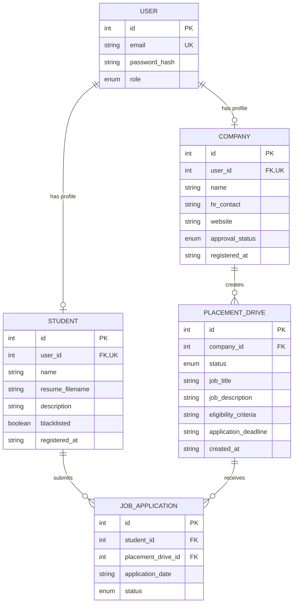

# Database ER Diagram

This diagram is based on the SQLAlchemy models in `backend_app/models`.
Table names use Flask-SQLAlchemy's default naming convention from the model class names.

## Enum Values

- `USER.role`: `admin`, `company`, `student`
- `COMPANY.approval_status`: `pending`, `approved`, `rejected`, `blacklisted`
- `PLACEMENT_DRIVE.status`: `pending`, `active`, `declined`, `closed`
- `JOB_APPLICATION.status`: `applied`, `shortlisted`, `selected`, `rejected`

## Relationship Notes

- `student.user_id` is unique, so each student profile belongs to exactly one user.
- `company.user_id` is unique, so each company profile belongs to exactly one user.
- Deleting a user cascades to the linked student or company profile.
- Deleting a company cascades to its placement drives.
- Deleting a placement drive cascades to its job applications.
